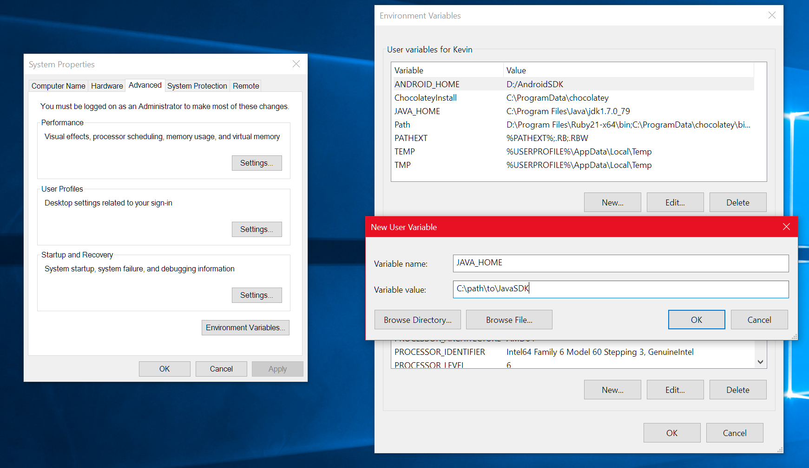

# React Native Creative - Spotify Player - SOFTWARE README

This document outlines the recommended setup to create a React Native Application for your project. The instructions provided represent the *generalized* steps only. Where links are provided, it is suggested that you follow those links to get detailed instructions if needed. However, there are some assumptions noted below.

##  Assumptions

1. You are running a recent (64-bit) version of your respective OS (Windows 10+ or Mac OS X High Sierra / Mojave / Catalina)
2. Plenty of hard drive space to install the software below for your OS and a decent amount of RAM and CPU. (8 GB RAM, i7 processor is suggested)
3. Any provided links within this document may be updated without notice, causing the links to break. This document will be refreshed at the instructor's discretion.
4. You have worked through some development processes before, i.e. you have perhaps created a website, so you are familiar with software installation processes. If not, consult with one of the technical leaders during the workshop so that you can be brought up to speed.

## Table of Contents

- [React Native Creative - Spotify Player - SOFTWARE README](#react-native-creative---spotify-player---software-readme)
  * [Table of Contents](#table-of-contents)
  * [Software Installs for Both Mac and Windows](#software-installs-for-both-mac-and-windows)
    + [Note - Java for Android Development](#note---java-for-android-development)
    + [Note - Potential Python Requirement for installing Expo CLI](#note---potential-python-requirement-for-installing-expo-cli)
    + [IDEs (Integrated Development Environments](#ides-integrated-development-environments)
    + [General Instructions - Review any OS specific instructions as noted below.](#general-instructions---review-any-os-specific-instructions-as-noted-below)
  * [Software Installs - Mac](#software-installs---mac)
    + [Additional Preqrequisites](#additional-preqrequisites)
    + [Homebrew](#homebrew)
    + [XCode and Command Line Tools](#xcode-and-command-line-tools)
    + [GIT](#git)
    + [Node / NPM](#node--npm)
    + [Yarn](#yarn)
    + [Watchman](#watchman)
    + [Expo CLI](#expo-cli)
      - [Notes About the Expo CLI Installation Process](#notes-about-the-expo-cli-installation-process)
  * [WINDOWS](#windows)
    + [Additional Prerequisites](#additional-prerequisites)
    + [Intel Virtualization Technology Hardware Requirement.](#intel-virtualization-technology-hardware-requirement)
    + [JAVA](#java)
    + [GIT with Windows](#git-with-windows)
    + [HAXM (Intel x86 Emulator Accelerator)](#haxm-intel-x86-emulator-accelerator)
    + [Node / NPM](#node--npm-on-windows)
    + [Yarn](#yarn-on-windows)
    + [Expo](#expo-on-windows)
    + [Install Android Studio and Appropriate SDK](#install-android-studio-and-appropriate-sdk)
  * [LINUX](#linux)
  * [TESTING SETUP OF A REACT NATIVE PROJECT](#testing-setup-of-a-react-native-project)
  * [FINAL STEPS](#final-steps)


## Software Installs for Both Mac and Windows

Whether or not you are running a Mac or Windows, you will need to install the following software to help you create a basic React Native App.

* [Git](https://git-scm.com/)
* [NodeJS / NPM](https://nodejs.org/en/)
* [Yarn](https://classic.yarnpkg.com/en/) - Note to install the 1.x version, as the 2.x version is installed on a per project basis is and not heavily supported yet.
* [Expo CLI](https://docs.expo.io/versions/latest/get-started/installation/)
* [React Native CLI]()

### Note - Java for Android Development

You may wish to have installed a current version of Java SE SDK. This is definitely needed for Windows users, or Mac Users who wish to develop on Android devices.

* Minimum Version requirement is - [JDK 8](https://www.oracle.com/java/technologies/javase/javase-jdk8-downloads.html)
* Current Version is [JDK 13](https://www.oracle.com/java/technologies/javase-jdk13-downloads.html)

A lot of development and tutorials utilize the JDK 8 version (because history) but the current version should be good too.

### Note - Potential Python Requirement for installing Expo CLI

These items *may be needed* . Note that Python 2 and 3 alongside each other require specialized instructions beyond the scope of this workshop. The basic premise is to have Python 2 and 3 running side by side in your respective OS. However, see notes for your respective OS below. The links below for configuring Python are not definitive but represent example setups. Python installation is referenced to address a particular issue when installing the Expo CLI.

* [Setup of Python 2.x / 3.x in Windows](https://datascience.com.co/how-to-install-python-2-7-and-3-6-in-windows-10-add-python-path-281e7eae62a)

* [Setup of Python 2.x / 3.x on Mac with Pyenv / Virtualenv / Virtualenvwrapper](https://gist.github.com/wronk/a902185f5f8ed018263d828e1027009b)

* [Python 2.7.x](https://www.python.org/downloads/release/python-2714/)
* [Python 3.x](https://www.python.org/downloads/release/python-382/)


### IDEs (Integrated Development Environments

* As always, we preach an unopinionated, agnostic environment as much as possible, so it doesn't really matter what IDE you wish to use. However, we can utilize these. Note though that we are *not* going to talk about IDE specifics. There is an assumption that you know how to use the IDE you and up working with. Yes, there may be plugins, extensions, features that will help facilitate workflow, but really you want to focus upon the code.

- [Microsoft Visual Studio Code](https://code.visualstudio.com/)
- [Jetbrains Webstorm](https://www.jetbrains.com/webstorm/)

Both are supported in Mac and PC environments (I believe Linux too, but see our notes on Linux below).

With each of these software products, you may need to refer to specific installation notes below.

###  General Instructions - Review any OS specific instructions as noted below.

1. Install Git from the website above.
2. Install Node / NPM (see notes for your OS, below)
3. Install Yarn.
4. Install Expo CLI - may need to coordinate with a Python Installation (see notes for your OS below)
5. Install React Native CLI.
6. Install your IDE.


## Software Installs - Mac

### Additional Preqrequisites

* Install [Homebrew](https://brew.sh/)
* Install or update your version of [XCode](https://apps.apple.com/us/app/xcode/id497799835?mt=12) and the [Command Line Development Tools](https://developer.apple.com/xcode/features/) using the command `xcode-select --install` in the Mac OS X terminal (you can look up this link for some info [here](https://osxdaily.com/2014/02/12/install-command-line-tools-mac-os-x/) ). Command Line Tools should come with XCode.
* Install [Android Studio](https://developer.android.com/studio#downloads), choosing the dmg installer and the appropriate Android SDK
* Install [Watchman](https://facebook.github.io/watchman/docs/install.html) *after* Installing - Homebrew, and  Node / NPM but *before* installing Expo CLI
* (Optional) Install [CocoaPods](https://cocoapods.org/)
* (Optional) Install [Node Version Manager (NVM)](https://github.com/nvm-sh/nvm)

See notes on each aspect of software below.

### Homebrew

Install Homebrew allows you to install additional tools, including some of the tools already mentioned here (Git, Python, Node / NPM, Yarn).

You may wish to install Python, Node / NPM and Yarn with Homebrew as an *alternative* installation process should the package installers fail to install properly. It is a good idea to have Homebrew installed anyway should you need to install any additional OS tools.

### XCode and Command Line Tools

This will take a long time to download, so be prepared to have it installed and updated ideally before class, or you may site idle for a bit. Download [here](http://itunes.apple.com/us/app/xcode/id497799835?ls=1&mt=12)

### GIT

1. You can download and install Git from [here](https://git-scm.com/)

### Node / NPM

1. You can use Homebrew to install Node / NPM using `brew install node` or install the package installer direct from the [website](https://nodejs.org/en/download/).

Confirm your version of Node and NPM within your terminal

`node --version`

and

`npm --version`

See also _Node Version Manager (NVM)_

### Yarn

Yarn is a package manager similar to NPM. You can run the entire React Native Setup and Development using Yarn instead of NPM. The key is to *be consistent*. When we are installing various Node / React packages, use one package manager only during the entire process.

Make sure you install the latest version of  *Classic Yarn* (Version 1.x). Version 2.x is a little too new and may give you headaches). The current version at the time of writing this document is 1.22.0

Install Classic Yarn from [here](https://classic.yarnpkg.com/en/docs/install/)

Confirm installation of Yarn from within your terminal

`yarn --version`

### Watchman

Watchman watches files and records when they change, then triggers actions in response to this, and it is used internally by React Native.

Using *Homebrew*, install Watchman from the Mac OS Terminal as shown below.

```
$ brew update
$ brew install watchman
```

Confirm that Watchman is installed by checking its version number at the terminal

`watchman --version`


### Expo CLI

The Expo CLI is a command line interface program that provides access to the Expo toolset, which is strongly aligned for React Native Development.

Installing the Expo CLI requires Node / NPM for installation.

Use the following command to install the current version of Expo CLI.

`npm install -g expo-cli`


#### Notes About the Expo CLI Installation Process

Installing the Expo CLI may display errors in the terminal regarding requirements for Python. Refer [here](https://github.com/expo/expo-cli/issues/590) for some information.

If the above command does not work, you *may choose* to configure Python 2.x in your operating system (note that you may have to co-ordinate its installation with Python 3.x if you have Python 3.x installed already). Alternatively, you can try the following command to install Expo as suggested in the Github issue topic referenced earlier.

`sudo npm install --unsafe-perm -g expo-cli`

Confirm that expo is installed by typing in

`expo --version`

or

`expo-cli --version`

## WINDOWS

Since you cannot create iOS apps with React Native on Windows, you are stuck for now with developing for Android.

### Additional Prerequisites

* Java SE SDK (For sure)
* Android Studio (For sure)
* HAXM (Intel x86 Emulator Accelerator)

Your Windows PC must support Intel Virtualization Technology by applying a setting in the BIOS.

### Intel Virtualization Technology Hardware Requirement.

Most newer Windows PCs come with Intel Virtualization Technology supported, but it may need to be enabled in your PC's BIOS. The location of the setting in the BIOS will vary from computer to computer. Please refer to the following requirements and guidance on Stack Overflow:

[Enabling VT-x tech in your system]()https://2nwiki.2n.cz/pages/viewpage.action?pageId=75202968

[Stack Overflow Discussion on HAXM and Intel Virtualization Requirements](https://stackoverflow.com/questions/21635504/error-during-installing-haxm-vt-x-not-working)

[Intel HAXM installation error - This computer does not support Intel Virtualization Technology (VT-x)](https://stackoverflow.com/questions/16091677/intel-haxm-installation-error-this-computer-does-not-support-intel-virtualizat)

Install Java afterward, and enable HAXM in Windows afterward.

### JAVA

If you don't have Java installed already, then follow these instructions.


1. Download and install the Java SE SDK as noted in the topic "Note - Java for Android Development" above.
2. Create an environment variable with the Java SDK path: Windows → Search → System → Advanced System Settings → Environment variables → New

`JAVA_HOME: C:\path\to\JavaSDK`

where \path\to\ is the direction where your Java SDK was installed.

You may have to also set a path to the Android SDK folder:

`ANDROID_HOME: C:\path\to\AndroidSDK`

The diagram below provides some insight indicating where to apply your settings.



3. You may also have to set another variable, ANDROID_HOME, to point to the location of the installed SDKs.

### GIT with Windows

1. You can download and install Git from [here](https://git-scm.com/)


### HAXM (Intel x86 Emulator Accelerator)

You will need the Intel x86 Emulator Accelerator (HAXM installer) to run the emulator on Windows. For more information, please refer to the following link:

https://github.com/intel/haxm/wiki/Installation-Instructions-on-Windows


### Node / NPM on Windows

1. Install Node / NPM from the NodeJS website [here](https://nodejs.org/en/)


### Yarn on Windows

Yarn is a package manager similar to NPM. You can run the entire React Native Setup and Development using Yarn instead of NPM. The key is to *be consistent*. When we are installing various Node / React packages, use one package manager only during the entire process.

Make sure you install the latest version of  *Classic Yarn* (Version 1.x). Version 2.x is a little too new and may give you headaches). The current version at the time of writing this document is 1.22.0

Install Classic Yarn from [here](https://classic.yarnpkg.com/en/docs/install/)

Confirm installation of Yarn from within your terminal

`yarn --version`

### Expo on Windows

The Expo CLI is a command line interface program that provides access to the Expo toolset, which is strongly aligned for React Native Development.

Installing the Expo CLI requires Node / NPM for installation.

Windows users will have several terminal options, assuming Windows 10.
- The Windows Command Prompt
- Windows Powershell
- Git Bash Shell (assuming you installed Git at the above link)

These instructions assume you are installing from the Windows Command Prompt. Use the Git Bash Shell as a fallback if there are problems, and use Windows Powershell only at the discretion of your instructor / team lead.


Use the following command to install the current version of Expo CLI.

`npm install -g expo-cli`

If there are issues (error messages indicating a need for Python 2), you *may* install [Python 2](https://www.python.org/downloads/release/python-2717/) at your discretion, then run the above command again.

Alternatively you can try this option:

`sudo npm install --unsafe-perm -g expo-cli`

(see [here](https://github.com/expo/expo-cli/issues/590)) for additional information.


### Install Android Studio and Appropriate SDK

Install [Android Studio](https://developer.android.com/studio#downloads), choosing the current Windows .exe installer and the appropriate Android SDK.

Then proceed to set up Android Studio, creating an empty Android Studio project. Then create an Android Virtual Device: Go to Manage AVD → Create. Finally, Boot up that Android Virtual Device.

Additional information can be found in the links below:

[Installing Android SDK on Windows / Mac / Linux](https://www.androidcentral.com/installing-android-sdk-windows-mac-and-linux-tutorial)

[Android SDK and AVD Setup for React Native](https://www.youtube.com/watch?v=KRLLjlpy0r4)

## LINUX

We're *not* going to talk about Linux setup at this time, although you can definitely give it a try, but we are going to put this OS in *unsupported* state for now. Generally follow the rules for Mac OS

## TESTING SETUP OF A REACT NATIVE PROJECT

1. Launch your terminal (Mac OS Terminal or Git Bash Shell)
2. If you have a folder that you already use for your projects, navigate to that folder.
3. Within the folder, execute the following command.

`expo init testproject`

`cd testproject`

`npm start`

or

`yarn start`

(observe what creating a app does, using *yarn* or *npm* and maintain using the same package manager from there)


## FINAL STEPS

1. Install your IDEs to prepare your project.

